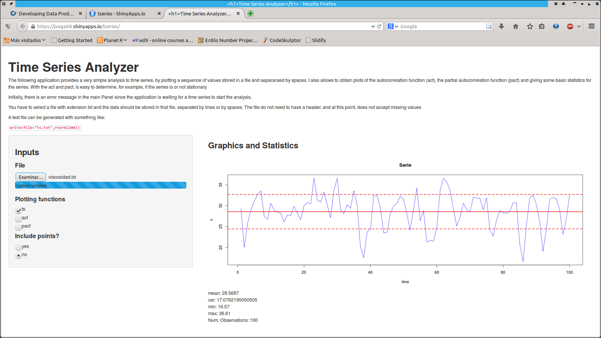

### What is it?

Time series is an important part of the statistical methodology, and I consider making a tool for 
ploting the three more important plots of this area. 

### Input

My app takes as input a simple text file containing a sequence of numbers separated by space or end of line symbols.
One example of a simple file has a series that looks like the following output, but considered in a file:

```{r, echo=TRUE, results='asis'}
write(rnorm(5),"",sep="\n")
```

### Output

The output from the app is an optional set of three plots: 1. the time series plot of the data, 
2. a plot of the autocorrelation function (acf), and  3. a plot of the partial autocorrelation function (pacf). Also includes some basic statistics of the series.

---  

### Empirical moments of time series

In combination with a plot of the time series sequence, the first and second moments are exploratory tools in the statistical analysis. The mean and the variance only make sense if the series is <b>stationary</b> :
 $\bar{y} = \frac{1}{T}\sum_{t=1}^T y_t$ describes the central location of the series, and 
  $\hat{\sigma} = \frac{1}{T}\sum_{t=1}^T (y_t-\bar{y})^2 =\hat{\gamma}_y(0)$  describes the series volatility.Both measures are added to the plot.  The sample autocovariance function is given by:  
  \[ \hat{\gamma}(h)= \frac{1}{k}\sum_{t=h+1}^T (y_t-\bar{y})(y_{t-h}-\bar{y}), \]  
  where  $k$ is  $T-h$, and the empirical autocorrelation is given by:
\[ \hat{\rho}(h)= \frac{\hat{\gamma}(h)}{\hat{\gamma}(0)} \]
The (auto)correlogram (or acf) is a graph of $\hat{\rho}(h)$ versus $h$.
*******

--- 

### Application

You can find the application in the following link: https://jvega68.shinyapps.io/tseries/

<div style='text-align: center;'>
    
</div>

---

### Future work 

The first version only includes some descriptive analysis of the series. What is planned for the future includes:

1. Adding some smoothing options to the plot.
2. Test for non-stationarity.
3. Remove the non-stationarity by differencing the series.
4. Options for estimating the order of an ARIMA model.
5. The possibility to fit a particular model for forecasting.

Any comment for improvement is welcome! 


